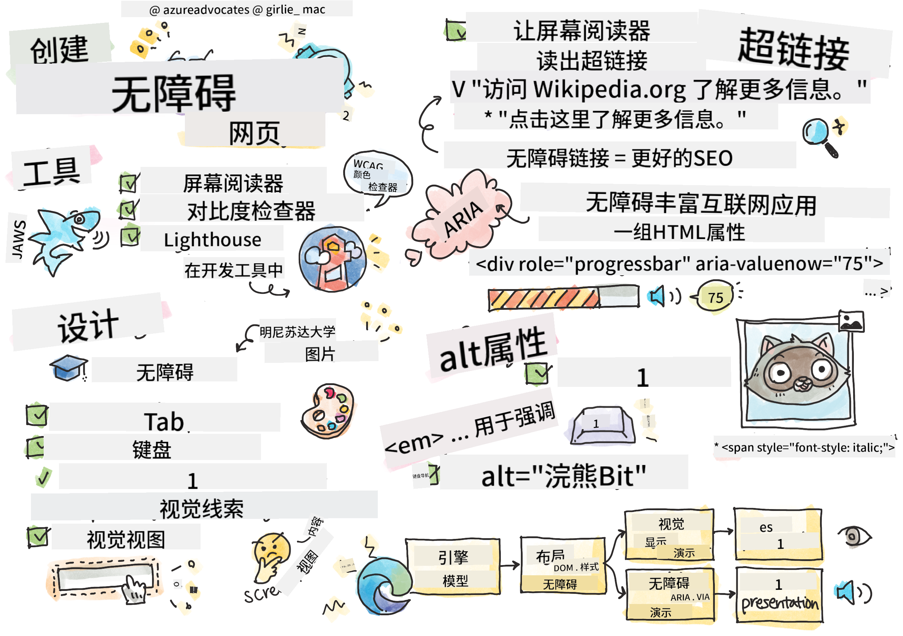

<!--
CO_OP_TRANSLATOR_METADATA:
{
  "original_hash": "f0c88c3e2cefa8952d356f802b1e47ca",
  "translation_date": "2025-08-29T14:53:20+00:00",
  "source_file": "1-getting-started-lessons/3-accessibility/README.md",
  "language_code": "zh"
}
-->
# 创建无障碍网页


> 由 [Tomomi Imura](https://twitter.com/girlie_mac) 绘制的速记图

## 课前测验
[课前测验](https://ff-quizzes.netlify.app/web/)

> Web 的力量在于它的普遍性。无论是否有残疾，每个人都能访问是其核心特性。
>
> \- 提姆·伯纳斯-李爵士，W3C 主任及万维网发明者

这句话完美地强调了创建无障碍网站的重要性。如果一个应用无法被所有人访问，那么它本质上就是排他的。作为网页开发者，我们应该始终将无障碍性放在心上。从一开始就关注这一点，您将能够确保每个人都能访问您创建的页面。在本课中，您将学习如何使用工具确保您的网页资源是无障碍的，以及如何以无障碍为目标进行构建。

> 您可以在 [Microsoft Learn](https://docs.microsoft.com/learn/modules/web-development-101/accessibility/?WT.mc_id=academic-77807-sagibbon) 上学习本课程！

## 可用工具

### 屏幕阅读器

屏幕阅读器是最知名的无障碍工具之一。

[屏幕阅读器](https://en.wikipedia.org/wiki/Screen_reader) 是视力受损者常用的客户端。当我们花时间确保浏览器正确传达我们想要分享的信息时，我们也必须确保屏幕阅读器能做到同样的事情。

屏幕阅读器的基本功能是从上到下以语音形式朗读页面。如果您的页面全是文本，阅读器会以类似浏览器的方式传达信息。当然，网页很少是纯文本的；它们通常包含链接、图形、颜色和其他视觉元素。我们需要确保这些信息能够被屏幕阅读器正确朗读。

每个网页开发者都应该熟悉屏幕阅读器。正如上文所述，这是用户将使用的客户端。就像您熟悉浏览器的操作方式一样，您也应该了解屏幕阅读器的操作方式。幸运的是，大多数操作系统都内置了屏幕阅读器。

一些浏览器还内置了工具和扩展，可以朗读文本甚至提供一些基本的导航功能，例如 [这些专注于无障碍的 Edge 浏览器工具](https://support.microsoft.com/help/4000734/microsoft-edge-accessibility-features)。这些工具也是重要的无障碍工具，但它们的功能与屏幕阅读器非常不同，不应将它们误认为是屏幕阅读器测试工具。

✅ 试用屏幕阅读器和浏览器文本阅读器。在 Windows 系统中，[Narrator](https://support.microsoft.com/windows/complete-guide-to-narrator-e4397a0d-ef4f-b386-d8ae-c172f109bdb1/?WT.mc_id=academic-77807-sagibbon) 是默认内置的，[JAWS](https://webaim.org/articles/jaws/) 和 [NVDA](https://www.nvaccess.org/about-nvda/) 也可以安装。在 macOS 和 iOS 系统中，[VoiceOver](https://support.apple.com/guide/voiceover/welcome/10) 是默认内置的。

### 缩放

视力受损者常用的另一种工具是缩放。最基本的缩放方式是静态缩放，通过 `Control + 加号 (+)` 或降低屏幕分辨率来控制。这种缩放方式会使整个页面调整大小，因此使用[响应式设计](https://developer.mozilla.org/docs/Learn/CSS/CSS_layout/Responsive_Design) 对于在高缩放级别下提供良好的用户体验非常重要。

另一种缩放方式依赖于专门的软件来放大屏幕的某一区域并进行平移，就像使用真正的放大镜一样。在 Windows 系统中，[Magnifier](https://support.microsoft.com/windows/use-magnifier-to-make-things-on-the-screen-easier-to-see-414948ba-8b1c-d3bd-8615-0e5e32204198) 是内置的，而 [ZoomText](https://www.freedomscientific.com/training/zoomtext/getting-started/) 是一款第三方放大软件，功能更多且用户群更大。在 macOS 和 iOS 系统中，有一个内置的放大软件叫 [Zoom](https://www.apple.com/accessibility/mac/vision/)。

### 对比度检查器

网站上的颜色需要仔细选择，以满足色盲用户或难以辨别低对比度颜色的用户的需求。

✅ 使用浏览器扩展（如 [WCAG 的颜色检查器](https://microsoftedge.microsoft.com/addons/detail/wcag-color-contrast-check/idahaggnlnekelhgplklhfpchbfdmkjp?hl=en-US&WT.mc_id=academic-77807-sagibbon)）测试您喜欢的网站的颜色使用情况。您学到了什么？

### Lighthouse

在浏览器的开发者工具区域，您会找到 Lighthouse 工具。这个工具对于初步了解网站的无障碍性（以及其他分析）非常重要。虽然不应完全依赖 Lighthouse，但 100% 的得分作为基线是非常有帮助的。

✅ 在浏览器的开发者工具面板中找到 Lighthouse，并对任意网站运行分析。您发现了什么？

## 为无障碍性设计

无障碍性是一个相对较大的话题。为了帮助您，有许多可用的资源。

- [Accessible U - 明尼苏达大学](https://accessibility.umn.edu/your-role/web-developers)

虽然我们无法涵盖创建无障碍网站的每个方面，但以下是您需要实现的一些核心原则。从一开始就设计一个无障碍页面**总是**比事后修改现有页面更容易。

## 良好的显示原则

### 安全的调色板

人们以不同的方式感知世界，包括颜色。在为您的网站选择配色方案时，您应该确保它对所有人都是无障碍的。一个很棒的[生成调色板的工具是 Color Safe](http://colorsafe.co/)。

✅ 找出一个在颜色使用上非常有问题的网站。为什么？

### 使用正确的 HTML

通过 CSS 和 JavaScript，可以让任何元素看起来像任何类型的控件。例如，`<span>` 可以用来创建一个 `<button>`，而 `<b>` 可以变成一个超链接。虽然这可能被认为更容易样式化，但它对屏幕阅读器没有任何意义。在页面上创建控件时，请使用适当的 HTML。如果您需要一个超链接，请使用 `<a>`。使用正确的 HTML 创建控件被称为使用语义化 HTML。

✅ 打开任意网站，查看设计师和开发者是否正确使用了 HTML。您能找到一个应该是链接却被做成按钮的例子吗？提示：右键单击并选择浏览器中的“查看页面源代码”以查看底层代码。

### 创建描述性标题层次结构

屏幕阅读器用户[非常依赖标题](https://webaim.org/projects/screenreadersurvey8/#finding)来查找信息并在页面中导航。编写描述性标题内容并使用语义化标题标签对于为屏幕阅读器用户创建易于导航的网站非常重要。

### 使用良好的视觉提示

CSS 提供了对页面上任何元素外观的完全控制。您可以创建没有边框的文本框或没有下划线的超链接。不幸的是，移除这些提示可能会让依赖它们的人更难识别控件的类型。

## 链接文本的重要性

超链接是浏览网页的核心。因此，确保屏幕阅读器能够正确朗读链接可以让所有用户都能导航您的网站。

### 屏幕阅读器与链接

正如您所预期的，屏幕阅读器会像朗读页面上的其他文本一样朗读链接文本。考虑到这一点，下面的文本示例可能看起来完全可以接受。

> 小企鹅，有时被称为仙女企鹅，是世界上最小的企鹅。[点击这里](https://en.wikipedia.org/wiki/Little_penguin)了解更多信息。

> 小企鹅，有时被称为仙女企鹅，是世界上最小的企鹅。访问 https://en.wikipedia.org/wiki/Little_penguin 了解更多信息。

> **注意** 正如您即将阅读到的，您**永远**不应该创建像上面这样的链接。

请记住，屏幕阅读器是与浏览器不同的界面，具有不同的功能集。

### 使用 URL 的问题

屏幕阅读器会朗读文本。如果文本中出现 URL，屏幕阅读器会朗读 URL。一般来说，URL 并不能传达有意义的信息，而且听起来可能很烦人。如果您的手机曾经语音朗读过带有 URL 的短信，您可能会有类似的体验。

### 使用“点击这里”的问题

屏幕阅读器还可以仅朗读页面上的超链接，就像视力正常的人会扫描页面寻找链接一样。如果链接文本总是“点击这里”，用户听到的将是“点击这里，点击这里，点击这里，点击这里，点击这里，……”。所有链接现在都无法区分。

### 良好的链接文本

良好的链接文本可以简要描述链接的内容。在上面关于小企鹅的示例中，链接指向该物种的维基百科页面。短语“小企鹅”将是完美的链接文本，因为它清楚地表明点击链接后可以了解什么——小企鹅。

> [小企鹅](https://en.wikipedia.org/wiki/Little_penguin)，有时被称为仙女企鹅，是世界上最小的企鹅。

✅ 浏览网页几分钟，寻找使用模糊链接策略的页面。将它们与其他链接更好的网站进行比较。您学到了什么？

#### 搜索引擎提示

确保您的网站对所有人无障碍的额外好处是，您还将帮助搜索引擎更好地导航您的网站。搜索引擎使用链接文本来了解页面的主题。因此，使用良好的链接文本对每个人都有帮助！

### ARIA

想象以下页面：

| 产品         | 描述              | 订购          |
| ------------ | ----------------- | ------------- |
| 小工具       | [描述](../../../../1-getting-started-lessons/3-accessibility/')       | [订购](../../../../1-getting-started-lessons/3-accessibility/')   |
| 超级小工具   | [描述](../../../../1-getting-started-lessons/3-accessibility/')       | [订购](../../../../1-getting-started-lessons/3-accessibility/')   |

在这个示例中，重复使用“描述”和“订购”对于使用浏览器的人来说是有意义的。然而，对于使用屏幕阅读器的人来说，他们只会听到“描述”和“订购”不断重复，没有上下文。

为了支持这些场景，HTML 支持一组称为[无障碍富互联网应用 (ARIA)](https://developer.mozilla.org/docs/Web/Accessibility/ARIA) 的属性。这些属性允许您为屏幕阅读器提供额外的信息。

> **注意**：与 HTML 的许多方面一样，浏览器和屏幕阅读器的支持可能会有所不同。然而，大多数主流客户端都支持 ARIA 属性。

您可以使用 `aria-label` 来描述链接，当页面的格式不允许您直接描述时。例如，可以为小工具的描述设置如下：

``` html
<a href="#" aria-label="Widget description">description</a>
```

✅ 通常，使用上述的语义化标记优先于使用 ARIA，但有时某些 HTML 小部件没有语义等价物。一个很好的例子是树形结构。HTML 中没有树形结构的等价物，因此您可以为该元素的通用 `<div>` 添加适当的角色和 ARIA 值。[MDN 上关于 ARIA 的文档](https://developer.mozilla.org/docs/Web/Accessibility/ARIA) 包含更多有用的信息。

```html
<h2 id="tree-label">File Viewer</h2>
<div role="tree" aria-labelledby="tree-label">
  <div role="treeitem" aria-expanded="false" tabindex="0">Uploads</div>
</div>
```

## 图片

显而易见，屏幕阅读器无法自动读取图片中的内容。确保图片无障碍并不需要太多工作——这正是 `alt` 属性的作用所在。所有有意义的图片都应该有一个 `alt` 来描述它们的内容。
纯装饰性的图片应该将其 `alt` 属性设置为空字符串：`alt=""`。这样可以防止屏幕阅读器不必要地朗读装饰性图片。

✅ 正如您可能预料的，搜索引擎也无法理解图片中的内容。它们也使用 alt 文本。因此，再次确保您的页面无障碍会带来额外的好处！

## 键盘

一些用户无法使用鼠标或触控板，而是依赖键盘交互通过 Tab 键从一个元素导航到下一个元素。确保您的网站以逻辑顺序呈现内容，以便键盘用户可以按文档顺序访问每个交互元素。如果您使用语义化标记构建网页并使用 CSS 样式化其视觉布局，您的网站应该是可通过键盘导航的，但手动测试这一点非常重要。了解更多关于[键盘导航策略](https://webaim.org/techniques/keyboard/)的信息。

✅ 打开任意网站，仅使用键盘尝试导航。哪些地方有效，哪些地方无效？为什么？

## 总结

一个仅对部分人无障碍的网络并不是真正的“全球网络”。确保您创建的网站无障碍的最佳方法是从一开始就将无障碍性最佳实践融入您的工作流程中。虽然这需要额外的步骤，但现在将这些技能融入您的工作流程意味着您创建的所有页面都将是无障碍的。

---

## 🚀 挑战

使用您学到的策略，将以下 HTML 重写为尽可能无障碍。

```html
<!DOCTYPE html>
<html>
  <head>
    <title>
      Example
    </title>
    <link href='../assets/style.css' rel='stylesheet' type='text/css'>
  </head>
  <body>
    <div class="site-header">
      <p class="site-title">Turtle Ipsum</p>
      <p class="site-subtitle">The World's Premier Turtle Fan Club</p>
    </div>
    <div class="main-nav">
      <p class="nav-header">Resources</p>
      <div class="nav-list">
        <p class="nav-item nav-item-bull"><a href="https://www.youtube.com/watch?v=CMNry4PE93Y">"I like turtles"</a></p>
        <p class="nav-item nav-item-bull"><a href="https://en.wikipedia.org/wiki/Turtle">Basic Turtle Info</a></p>
        <p class="nav-item nav-item-bull"><a href="https://en.wikipedia.org/wiki/Turtles_(chocolate)">Chocolate Turtles</a></p>
      </div>
    </div>
    <div class="main-content">
      <div>
        <p class="page-title">Welcome to Turtle Ipsum. 
            <a href="">Click here</a> to learn more.
        </p>
        <p class="article-text">
          Turtle ipsum dolor sit amet, consectetur adipiscing elit, sed do eiusmod tempor incididunt ut labore et dolore magna aliqua. Ut enim ad minim veniam, quis nostrud exercitation ullamco laboris nisi ut aliquip ex ea commodo consequat. Duis aute irure dolor in reprehenderit in voluptate velit esse cillum dolore eu fugiat nulla pariatur. Excepteur sint occaecat cupidatat non proident, sunt in culpa qui officia deserunt mollit anim id est laborum
        </p>
      </div>
    </div>
    <div class="footer">
      <div class="footer-section">
        <span class="button">Sign up for turtle news</span>
      </div><div class="footer-section">
        <p class="nav-header footer-title">
          Internal Pages
        </p>
        <div class="nav-list">
          <p class="nav-item nav-item-bull"><a href="../">Index</a></p>
          <p class="nav-item nav-item-bull"><a href="../semantic">Semantic Example</a></p>
        </div>
      </div>
      <p class="footer-copyright">&copy; 2016 Instrument</p>
    </div>
  </body>
</html>
```

## 课后测验
[课后测验](https://ff-quizzes.netlify.app/web/en/)

## 复习与自学
许多国家政府都有关于无障碍要求的法律。了解一下你所在国家的无障碍法律。哪些内容被涵盖了，哪些没有？一个例子是[这个政府网站](https://accessibility.blog.gov.uk/)。

## 作业

[分析一个不具备无障碍功能的网站](assignment.md)

致谢: [Turtle Ipsum](https://github.com/Instrument/semantic-html-sample) 由 Instrument 提供

---

**免责声明**：  
本文档使用AI翻译服务[Co-op Translator](https://github.com/Azure/co-op-translator)进行翻译。尽管我们努力确保准确性，但请注意，自动翻译可能包含错误或不准确之处。应以原始语言的文档作为权威来源。对于关键信息，建议使用专业人工翻译。我们对因使用本翻译而引起的任何误解或误读不承担责任。