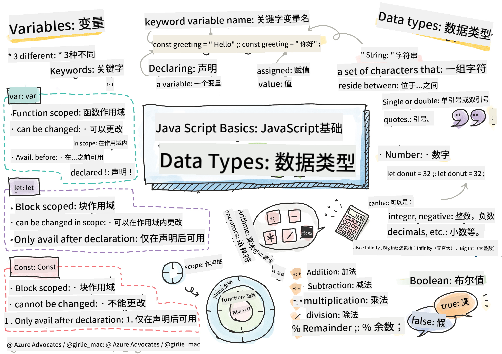

<!--
CO_OP_TRANSLATOR_METADATA:
{
  "original_hash": "b95fdd8310ef467305015ece1b0f9411",
  "translation_date": "2025-08-29T14:48:32+00:00",
  "source_file": "2-js-basics/1-data-types/README.md",
  "language_code": "zh"
}
-->
# JavaScript 基础：数据类型

  
> 由 [Tomomi Imura](https://twitter.com/girlie_mac) 绘制的手绘笔记

## 课前测验  
[课前测验](https://ff-quizzes.netlify.app/web/)

本课将介绍 JavaScript 的基础知识，这是一种为网页提供交互功能的语言。

> 你可以在 [Microsoft Learn](https://docs.microsoft.com/learn/modules/web-development-101-variables/?WT.mc_id=academic-77807-sagibbon) 上学习本课程！

[](https://youtube.com/watch?v=JNIXfGiDWM8 "JavaScript 中的变量")

[](https://youtube.com/watch?v=AWfA95eLdq8 "JavaScript 中的数据类型")

> 🎥 点击上方图片观看关于变量和数据类型的视频

让我们从变量和填充它们的数据类型开始吧！

## 变量

变量用于存储值，这些值可以在代码中使用并随时更改。

创建和**声明**变量的语法是 **[关键字] [名称]**，它由以下两部分组成：

- **关键字**。关键字可以是 `let` 或 `var`。

✅ `let` 关键字是在 ES6 中引入的，它为变量提供了所谓的 _块级作用域_。推荐使用 `let` 而不是 `var`。我们将在后续部分更深入地讨论块级作用域。
- **变量名**，这是你自己选择的名称。

### 任务 - 使用变量

1. **声明一个变量**。让我们使用 `let` 关键字声明一个变量：

    ```javascript
    let myVariable;
    ```

   现在，`myVariable` 已经使用 `let` 关键字声明了，但目前还没有赋值。

1. **赋值**。使用 `=` 运算符为变量存储一个值，后面跟随期望的值。

    ```javascript
    myVariable = 123;
    ```

   > 注意：在本课中，`=` 表示我们使用了“赋值运算符”，用于为变量设置值。它并不表示相等。

   现在，`myVariable` 已经被赋值为 123。

1. **重构**。将代码替换为以下语句：

    ```javascript
    let myVariable = 123;
    ```

    上述操作称为 _显式初始化_，即在声明变量的同时为其赋值。

1. **更改变量值**。通过以下方式更改变量值：

   ```javascript
   myVariable = 321;
   ```

   一旦声明了变量，你可以随时使用 `=` 运算符和新值更改其值。

   ✅ 试试看！你可以直接在浏览器中编写 JavaScript。打开浏览器窗口并导航到开发者工具。在控制台中，你会看到一个提示符；输入 `let myVariable = 123`，按回车键，然后输入 `myVariable`。会发生什么？注意，你将在后续课程中学习更多相关概念。

## 常量

常量的声明和初始化与变量的概念相同，但使用的是 `const` 关键字。常量通常使用全大写字母声明。

```javascript
const MY_VARIABLE = 123;
```

常量与变量类似，但有两个例外：

- **必须有值**。常量必须在声明时初始化，否则运行代码时会报错。
- **引用不可更改**。一旦初始化，常量的引用不能更改，否则运行代码时会报错。以下是两个示例：
   - **简单值**。以下操作不被允许：
   
      ```javascript
      const PI = 3;
      PI = 4; // not allowed
      ```
 
   - **对象引用受保护**。以下操作不被允许：
   
      ```javascript
      const obj = { a: 3 };
      obj = { b: 5 } // not allowed
      ```

    - **对象值未受保护**。以下操作被允许：
    
      ```javascript
      const obj = { a: 3 };
      obj.a = 5;  // allowed
      ```

      上述代码更改了对象的值，但没有更改其引用，因此是允许的。

   > 注意，`const` 表示引用受到保护，不能重新赋值。但值本身并非 _不可变_，尤其是当它是一个复杂结构（如对象）时，值仍然可以更改。

## 数据类型

变量可以存储多种不同类型的值，例如数字和文本。这些不同类型的值被称为**数据类型**。数据类型是软件开发中的重要组成部分，因为它帮助开发者决定代码的编写方式以及软件的运行方式。此外，一些数据类型具有独特的特性，可以帮助转换或提取值中的附加信息。

✅ 数据类型也被称为 JavaScript 数据原始类型，因为它们是语言提供的最低级别的数据类型。JavaScript 中有 7 种原始数据类型：string、number、bigint、boolean、undefined、null 和 symbol。花点时间想象一下这些原始类型分别代表什么。`zebra` 是什么？`0` 又是什么？`true` 呢？

### 数字

在上一节中，`myVariable` 的值是一个数字数据类型。

`let myVariable = 123;`

变量可以存储所有类型的数字，包括小数或负数。数字还可以与算术运算符一起使用，这将在[下一节](../../../../2-js-basics/1-data-types)中介绍。

### 算术运算符

在执行算术操作时，可以使用多种运算符，以下列出了一些：

| 符号 | 描述                                                                   | 示例                              |
| ---- | ---------------------------------------------------------------------- | --------------------------------- |
| `+`  | **加法**：计算两个数字的和                                            | `1 + 2 // 预期答案是 3`           |
| `-`  | **减法**：计算两个数字的差                                            | `1 - 2 // 预期答案是 -1`          |
| `*`  | **乘法**：计算两个数字的积                                            | `1 * 2 // 预期答案是 2`           |
| `/`  | **除法**：计算两个数字的商                                            | `1 / 2 // 预期答案是 0.5`         |
| `%`  | **取余**：计算两个数字相除后的余数                                    | `1 % 2 // 预期答案是 1`           |

✅ 试试看！在浏览器的控制台中尝试一个算术操作。结果是否让你感到惊讶？

### 字符串

字符串是一组位于单引号或双引号之间的字符。

- `'这是一个字符串'`
- `"这也是一个字符串"`
- `let myString = '这是存储在变量中的字符串值';`

记得在编写字符串时使用引号，否则 JavaScript 会认为它是一个变量名。

### 格式化字符串

字符串是文本，有时需要进行格式化。

要**连接**两个或多个字符串（即将它们拼接在一起），可以使用 `+` 运算符。

```javascript
let myString1 = "Hello";
let myString2 = "World";

myString1 + myString2 + "!"; //HelloWorld!
myString1 + " " + myString2 + "!"; //Hello World!
myString1 + ", " + myString2 + "!"; //Hello, World!

```

✅ 为什么在 JavaScript 中 `1 + 1 = 2`，而 `'1' + '1' = 11`？想一想。那 `'1' + 1` 又会怎样？

**模板字符串**是另一种格式化字符串的方法，不同之处在于它使用反引号代替引号。任何非纯文本的内容都必须放在占位符 `${ }` 中。这包括可能是字符串的变量。

```javascript
let myString1 = "Hello";
let myString2 = "World";

`${myString1} ${myString2}!` //Hello World!
`${myString1}, ${myString2}!` //Hello, World!
```

你可以使用任意一种方法实现格式化目标，但模板字符串会保留所有空格和换行。

✅ 你会在什么情况下使用模板字符串而不是普通字符串？

### 布尔值

布尔值只有两个可能的值：`true` 或 `false`。布尔值可以帮助决定在满足某些条件时运行哪些代码行。在许多情况下，[运算符](../../../../2-js-basics/1-data-types) 会协助设置布尔值，你会经常看到变量在初始化时或其值更新时使用运算符。

- `let myTrueBool = true`
- `let myFalseBool = false`

✅ 如果一个变量的值被认为是布尔值 `true`，则它可以被视为“真值”。有趣的是，在 JavaScript 中，[所有值都是真值，除非被定义为假值](https://developer.mozilla.org/docs/Glossary/Truthy)。

---

## 🚀 挑战

JavaScript 因其在处理数据类型时的一些令人惊讶的方式而臭名昭著。研究一下这些“陷阱”。例如：大小写敏感可能会让你吃亏！在控制台中试试这个：`let age = 1; let Age = 2; age == Age`（结果是 `false` —— 为什么？）。你还能找到哪些陷阱？

## 课后测验  
[课后测验](https://ff-quizzes.netlify.app)

## 复习与自学

查看[这份 JavaScript 练习列表](https://css-tricks.com/snippets/javascript/)并尝试完成其中一个。你学到了什么？

## 作业

[数据类型练习](assignment.md)

---

**免责声明**：  
本文档使用AI翻译服务[Co-op Translator](https://github.com/Azure/co-op-translator)进行翻译。尽管我们努力确保翻译的准确性，但请注意，自动翻译可能包含错误或不准确之处。原始语言的文档应被视为权威来源。对于关键信息，建议使用专业人工翻译。我们不对因使用此翻译而产生的任何误解或误读承担责任。