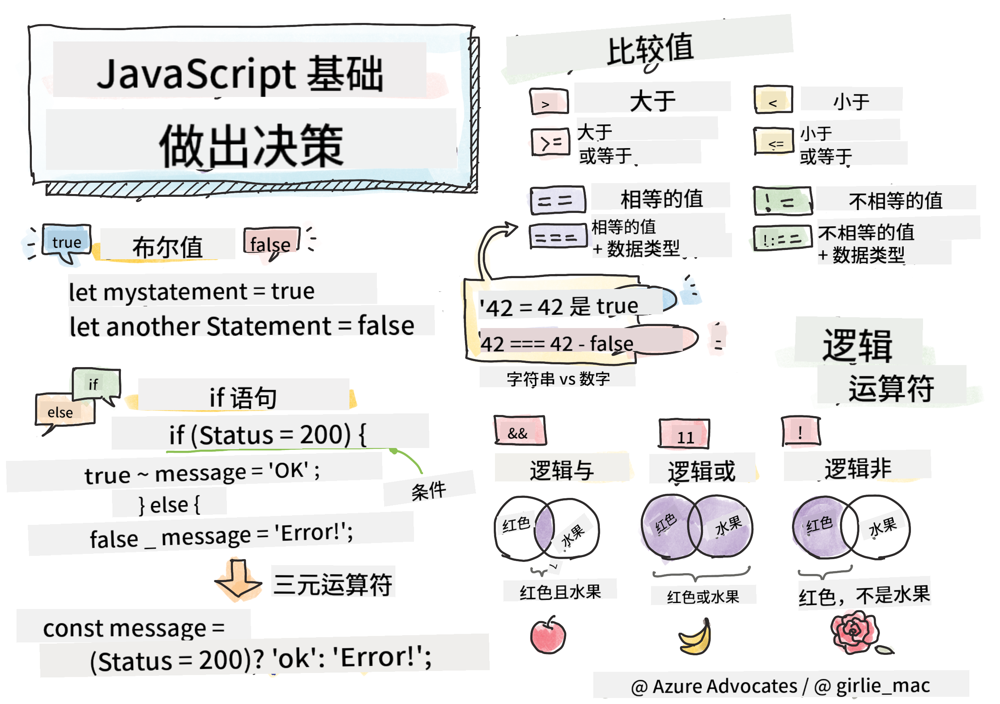

<!--
CO_OP_TRANSLATOR_METADATA:
{
  "original_hash": "f7009631b73556168ca435120a231c98",
  "translation_date": "2025-08-29T14:48:11+00:00",
  "source_file": "2-js-basics/3-making-decisions/README.md",
  "language_code": "zh"
}
-->
# JavaScript 基础：做出决策



> 由 [Tomomi Imura](https://twitter.com/girlie_mac) 绘制的速记笔记

## 课前测验

[课前测验](https://ff-quizzes.netlify.app/web/quiz/11)

做出决策并控制代码运行的顺序可以让代码更具复用性和稳健性。本节将介绍在 JavaScript 中控制数据流的语法，以及它与布尔数据类型结合使用时的重要性。

[](https://youtube.com/watch?v=SxTp8j-fMMY "做出决策")

> 🎥 点击上方图片观看关于做出决策的视频。

> 你可以在 [Microsoft Learn](https://docs.microsoft.com/learn/modules/web-development-101-if-else/?WT.mc_id=academic-77807-sagibbon) 上学习本课程！

## 布尔值简要回顾

布尔值只有两个可能的值：`true` 或 `false`。布尔值帮助我们决定在满足某些条件时应该运行哪些代码行。

可以像这样设置布尔值为 true 或 false：

`let myTrueBool = true`  
`let myFalseBool = false`

✅ 布尔值以英国数学家、哲学家和逻辑学家 George Boole（1815–1864）的名字命名。

## 比较运算符与布尔值

运算符用于通过比较生成布尔值来评估条件。以下是一些常用运算符的列表。

| 符号  | 描述                                                                                                                                                   | 示例                |
| ----- | ------------------------------------------------------------------------------------------------------------------------------------------------------ | ------------------- |
| `<`   | **小于**：比较两个值，如果左侧值小于右侧值，则返回 `true` 布尔值                                                                                       | `5 < 6 // true`     |
| `<=`  | **小于或等于**：比较两个值，如果左侧值小于或等于右侧值，则返回 `true` 布尔值                                                                           | `5 <= 6 // true`    |
| `>`   | **大于**：比较两个值，如果左侧值大于右侧值，则返回 `true` 布尔值                                                                                       | `5 > 6 // false`    |
| `>=`  | **大于或等于**：比较两个值，如果左侧值大于或等于右侧值，则返回 `true` 布尔值                                                                           | `5 >= 6 // false`   |
| `===` | **严格相等**：比较两个值，如果左右两侧的值相等且数据类型相同，则返回 `true` 布尔值                                                                     | `5 === 6 // false`  |
| `!==` | **不等**：比较两个值，返回与严格相等运算符相反的布尔值                                                                                                 | `5 !== 6 // true`   |

✅ 在浏览器的控制台中写一些比较语句来检查你的知识。返回的数据是否有让你感到意外的地方？

## If 语句

如果条件为 true，if 语句将运行其块中的代码。

```javascript
if (condition) {
  //Condition is true. Code in this block will run.
}
```

逻辑运算符通常用于构成条件。

```javascript
let currentMoney;
let laptopPrice;

if (currentMoney >= laptopPrice) {
  //Condition is true. Code in this block will run.
  console.log("Getting a new laptop!");
}
```

## If..Else 语句

当条件为 false 时，`else` 语句将运行其块中的代码。它是 `if` 语句的可选部分。

```javascript
let currentMoney;
let laptopPrice;

if (currentMoney >= laptopPrice) {
  //Condition is true. Code in this block will run.
  console.log("Getting a new laptop!");
} else {
  //Condition is false. Code in this block will run.
  console.log("Can't afford a new laptop, yet!");
}
```

✅ 在浏览器控制台中运行这段代码以及后续代码来测试你的理解。更改 `currentMoney` 和 `laptopPrice` 变量的值以改变 `console.log()` 的返回结果。

## Switch 语句

`switch` 语句用于根据不同条件执行不同的操作。使用 `switch` 语句可以选择要执行的多个代码块之一。

```javascript
switch (expression) {
  case x:
    // code block
    break;
  case y:
    // code block
    break;
  default:
  // code block
}
```

```javascript
// program using switch statement
let a = 2;

switch (a) {
  case 1:
    a = "one";
    break;
  case 2:
    a = "two";
    break;
  default:
    a = "not found";
    break;
}
console.log(`The value is ${a}`);
```

✅ 在浏览器控制台中运行这段代码以及后续代码来测试你的理解。更改变量 `a` 的值以改变 `console.log()` 的返回结果。

## 逻辑运算符与布尔值

决策可能需要多个比较，可以通过逻辑运算符将它们串联起来以生成布尔值。

| 符号  | 描述                                                                                     | 示例                                                                 |
| ----- | ---------------------------------------------------------------------------------------- | -------------------------------------------------------------------- |
| `&&`  | **逻辑与**：比较两个布尔表达式。仅当两侧都为 true 时返回 true                            | `(5 > 6) && (5 < 6 ) //一侧为 false，另一侧为 true。返回 false`      |
| `\|\|` | **逻辑或**：比较两个布尔表达式。只要至少一侧为 true 就返回 true                          | `(5 > 6) \|\| (5 < 6) //一侧为 false，另一侧为 true。返回 true`      |
| `!`   | **逻辑非**：返回布尔表达式的相反值                                                       | `!(5 > 6) // 5 不大于 6，但 "!" 会返回 true`                         |

## 使用逻辑运算符的条件与决策

逻辑运算符可以用于在 if..else 语句中构成条件。

```javascript
let currentMoney;
let laptopPrice;
let laptopDiscountPrice = laptopPrice - laptopPrice * 0.2; //Laptop price at 20 percent off

if (currentMoney >= laptopPrice || currentMoney >= laptopDiscountPrice) {
  //Condition is true. Code in this block will run.
  console.log("Getting a new laptop!");
} else {
  //Condition is true. Code in this block will run.
  console.log("Can't afford a new laptop, yet!");
}
```

### 非运算符

到目前为止，你已经看到如何使用 `if...else` 语句来创建条件逻辑。任何进入 `if` 的内容都需要评估为 true 或 false。通过使用 `!` 运算符，你可以**取反**表达式。它看起来像这样：

```javascript
if (!condition) {
  // runs if condition is false
} else {
  // runs if condition is true
}
```

### 三元表达式

`if...else` 不是表达决策逻辑的唯一方式。你还可以使用一种称为三元运算符的方式。它的语法如下：

```javascript
let variable = condition ? <return this if true> : <return this if false>
```

下面是一个更具体的示例：

```javascript
let firstNumber = 20;
let secondNumber = 10;
let biggestNumber = firstNumber > secondNumber ? firstNumber : secondNumber;
```

✅ 花点时间多读几遍这段代码。你理解这些运算符是如何工作的了吗？

上述代码表示：

- 如果 `firstNumber` 大于 `secondNumber`
- 那么将 `firstNumber` 赋值给 `biggestNumber`
- 否则将 `secondNumber` 赋值给 `biggestNumber`。

三元表达式只是以下代码的简洁写法：

```javascript
let biggestNumber;
if (firstNumber > secondNumber) {
  biggestNumber = firstNumber;
} else {
  biggestNumber = secondNumber;
}
```

---

## 🚀 挑战

创建一个程序，首先使用逻辑运算符编写，然后使用三元表达式重写它。你更喜欢哪种语法？

---

## 课后测验

[课后测验](https://ff-quizzes.netlify.app/web/quiz/12)

## 复习与自学

阅读更多关于用户可用的运算符的信息：[MDN](https://developer.mozilla.org/docs/Web/JavaScript/Reference/Operators)。

浏览 Josh Comeau 的精彩 [运算符速查表](https://joshwcomeau.com/operator-lookup/)！

## 作业

[运算符](assignment.md)

---

**免责声明**：  
本文档使用AI翻译服务[Co-op Translator](https://github.com/Azure/co-op-translator)进行翻译。尽管我们努力确保准确性，但请注意，自动翻译可能包含错误或不准确之处。应以原始语言的文档作为权威来源。对于关键信息，建议使用专业人工翻译。因使用本翻译而导致的任何误解或误读，我们概不负责。