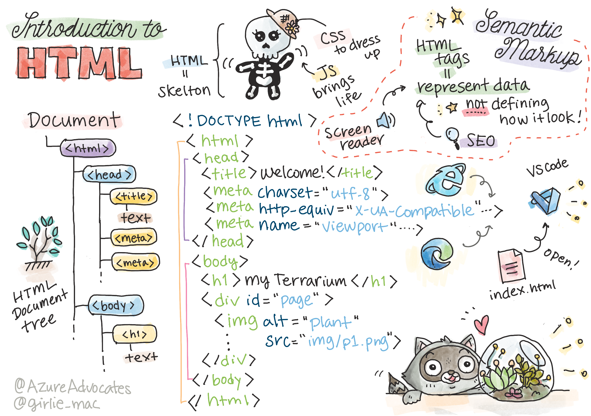

<!--
CO_OP_TRANSLATOR_METADATA:
{
  "original_hash": "46a0639e719b9cf1dfd062aa24cad639",
  "translation_date": "2025-08-23T22:24:02+00:00",
  "source_file": "3-terrarium/1-intro-to-html/README.md",
  "language_code": "zh"
}
-->
# Terrarium 项目第一部分：HTML 入门


> [Tomomi Imura](https://twitter.com/girlie_mac) 的手绘笔记

## 课前测验

[课前测验](https://ashy-river-0debb7803.1.azurestaticapps.net/quiz/15)

> 查看视频

> 
> [](https://www.youtube.com/watch?v=1TvxJKBzhyQ)

### 简介

HTML（超文本标记语言）是网页的“骨架”。如果说 CSS 是为 HTML“穿衣服”，JavaScript 是让它“活起来”，那么 HTML 就是网页应用的“身体”。HTML 的语法甚至反映了这一点，因为它包含了“head”、“body”和“footer”等标签。

在本课中，我们将使用 HTML 来布局虚拟生态瓶界面的“骨架”。界面将包括一个标题和三个列：左右两侧的列放置可拖动的植物，中间区域将是实际的玻璃生态瓶。到本课结束时，你将能够看到列中的植物，但界面看起来会有点奇怪；别担心，在下一节中，你将添加 CSS 样式来让界面看起来更美观。

### 任务

在你的电脑上创建一个名为“terrarium”的文件夹，并在其中创建一个名为“index.html”的文件。你可以在 Visual Studio Code 中完成此操作：创建 terrarium 文件夹后，打开一个新的 VS Code 窗口，点击“打开文件夹”，导航到你的新文件夹。然后点击资源管理器面板中的小“文件”按钮，创建新文件：


或者

使用以下命令在 git bash 中完成：
* `mkdir terrarium`
* `cd terrarium`
* `touch index.html`
* `code index.html` 或 `nano index.html`

> index.html 文件告诉浏览器它是文件夹中的默认文件；例如，`https://anysite.com/test` 可能是通过一个文件夹结构构建的，其中包括一个名为 `test` 的文件夹，里面有 `index.html` 文件；URL 中不一定会显示 `index.html`。

---

## DocType 和 html 标签

HTML 文件的第一行是它的 DocType。这行代码需要放在文件的最顶部，虽然看起来有点奇怪，但它告诉旧版浏览器需要以标准模式渲染页面，并遵循当前的 HTML 规范。

> 提示：在 VS Code 中，你可以将鼠标悬停在标签上，查看 MDN 参考指南中关于其用途的信息。

第二行应该是 `<html>` 标签的开始标签，紧接着是它的结束标签 `</html>`。这些标签是界面的根元素。

### 任务

在你的 `index.html` 文件顶部添加以下代码：

```HTML
<!DOCTYPE html>
<html></html>
```

✅ 通过设置 DocType 的查询字符串可以确定几种不同的模式：[Quirks 模式和标准模式](https://developer.mozilla.org/docs/Web/HTML/Quirks_Mode_and_Standards_Mode)。这些模式用于支持非常旧的浏览器（如 Netscape Navigator 4 和 Internet Explorer 5），但现在通常不再使用。你可以坚持使用标准的 DocType 声明。

---

## 文档的 'head'

HTML 文档的 'head' 区域包含关于网页的重要信息，也称为 [元数据](https://developer.mozilla.org/docs/Web/HTML/Element/meta)。在我们的例子中，我们告诉将渲染此页面的网络服务器以下四件事：

-   网页的标题
-   页面元数据，包括：
    -   字符集，指示页面使用的字符编码
    -   浏览器信息，包括 `x-ua-compatible`，指示支持 IE=edge 浏览器
    -   关于视口在加载时如何表现的信息。将视口设置为初始缩放比例为 1，可以控制页面首次加载时的缩放级别。

### 任务

在 `<html>` 标签的开始和结束标签之间添加一个 'head' 块。

```html
<head>
	<title>Welcome to my Virtual Terrarium</title>
	<meta charset="utf-8" />
	<meta http-equiv="X-UA-Compatible" content="IE=edge" />
	<meta name="viewport" content="width=device-width, initial-scale=1" />
</head>
```

✅ 如果你像这样设置视口元标签：`<meta name="viewport" content="width=600">`，会发生什么？阅读更多关于 [视口](https://developer.mozilla.org/docs/Web/HTML/Viewport_meta_tag) 的内容。

---

## 文档的 `body`

### HTML 标签

在 HTML 中，你可以在 .html 文件中添加标签来创建网页元素。每个标签通常都有一个开始和结束标签，例如：`<p>hello</p>` 表示一个段落。通过在 `<html>` 标签对内添加一组 `<body>` 标签来创建界面的主体；你的标记现在看起来像这样：

### 任务

```html
<!DOCTYPE html>
<html>
	<head>
		<title>Welcome to my Virtual Terrarium</title>
		<meta charset="utf-8" />
		<meta http-equiv="X-UA-Compatible" content="IE=edge" />
		<meta name="viewport" content="width=device-width, initial-scale=1" />
	</head>
	<body></body>
</html>
```

现在，你可以开始构建你的页面了。通常，你会使用 `<div>` 标签来创建页面中的各个元素。我们将创建一系列 `<div>` 元素，这些元素将包含图片。

### 图片

一个不需要结束标签的 HTML 标签是 `` 标签，因为它有一个 `src` 元素，包含页面渲染该项目所需的所有信息。

在你的应用中创建一个名为 `images` 的文件夹，并将 [源代码文件夹](../../../../3-terrarium/solution/images) 中的所有图片添加到其中；（有 14 张植物图片）。

### 任务

在 `<body></body>` 标签之间的两列中添加这些植物图片：

```html
<div id="page">
	<div id="left-container" class="container">
		<div class="plant-holder">
			
		</div>
		<div class="plant-holder">
			
		</div>
		<div class="plant-holder">
			
		</div>
		<div class="plant-holder">
			
		</div>
		<div class="plant-holder">
			
		</div>
		<div class="plant-holder">
			
		</div>
		<div class="plant-holder">
			
		</div>
	</div>
	<div id="right-container" class="container">
		<div class="plant-holder">
			
		</div>
		<div class="plant-holder">
			
		</div>
		<div class="plant-holder">
			
		</div>
		<div class="plant-holder">
			
		</div>
		<div class="plant-holder">
			
		</div>
		<div class="plant-holder">
			
		</div>
		<div class="plant-holder">
			
		</div>
	</div>
</div>
```

> 注意：Span 和 Div 的区别。Div 被认为是“块”元素，而 Span 是“内联”元素。如果你将这些 div 转换为 span，会发生什么？

通过这些标记，植物现在会显示在屏幕上。看起来很糟糕，因为它们还没有使用 CSS 样式化，我们将在下一课中完成样式化。

每张图片都有替代文本，即使你无法看到或渲染图片，替代文本也会显示。这是一个重要的属性，用于提高可访问性。在后续课程中了解更多关于可访问性的内容；现在，请记住，alt 属性为图片提供了替代信息，以防用户因某些原因无法查看图片（例如网络连接慢、src 属性错误或用户使用屏幕阅读器）。

✅ 你注意到每张图片都有相同的 alt 标签了吗？这是一个好习惯吗？为什么？你能改进这段代码吗？

---

## 语义化标记

通常，在编写 HTML 时，使用有意义的“语义化”标记是更好的选择。这是什么意思？这意味着你使用 HTML 标签来表示它们设计用于的数据或交互类型。例如，页面上的主要标题文本应该使用 `<h1>` 标签。

在你的 `<body>` 开始标签下方添加以下代码：

```html
<h1>My Terrarium</h1>
```

使用语义化标记，例如将标题设置为 `<h1>`，将无序列表渲染为 `<ul>`，可以帮助屏幕阅读器更好地导航页面。通常，按钮应该写为 `<button>`，列表应该写为 `<li>`。虽然可以使用带有点击处理程序的特殊样式 `<span>` 元素来模拟按钮，但对于残障用户来说，使用技术确定页面上的按钮位置并与之交互会更方便。如果元素显示为按钮，屏幕阅读器会更容易识别。因此，尽量使用语义化标记。

✅ 看看屏幕阅读器 [如何与网页交互](https://www.youtube.com/watch?v=OUDV1gqs9GA)。你能理解为什么非语义化标记可能会让用户感到沮丧吗？

## 生态瓶

界面的最后一部分涉及创建将被样式化为生态瓶的标记。

### 任务：

在最后一个 `</div>` 标签上方添加以下标记：

```html
<div id="terrarium">
	<div class="jar-top"></div>
	<div class="jar-walls">
		<div class="jar-glossy-long"></div>
		<div class="jar-glossy-short"></div>
	</div>
	<div class="dirt"></div>
	<div class="jar-bottom"></div>
</div>
```

✅ 尽管你添加了这些标记到屏幕上，但你什么都看不到。为什么？

---

## 🚀挑战

HTML 中有一些有趣的“旧”标签，虽然不建议使用已弃用的标签，例如 [这些标签](https://developer.mozilla.org/docs/Web/HTML/Element#Obsolete_and_deprecated_elements)，但它们仍然值得尝试。你能使用旧的 `<marquee>` 标签让 h1 标题水平滚动吗？（如果你这样做，记得之后将其删除）

## 课后测验

[课后测验](https://ashy-river-0debb7803.1.azurestaticapps.net/quiz/16)

## 复习与自学

HTML 是一种“久经考验”的构建块系统，帮助网页发展到今天的样子。通过研究一些旧标签和新标签，了解它的历史。你能弄清楚为什么某些标签被弃用，而某些标签被添加吗？未来可能会引入哪些标签？

了解更多关于为网页和移动设备构建网站的内容，请访问 [Microsoft Learn](https://docs.microsoft.com/learn/modules/build-simple-website/?WT.mc_id=academic-77807-sagibbon)。

## 作业

[练习 HTML：构建博客模型](assignment.md)

**免责声明**：  
本文档使用AI翻译服务 [Co-op Translator](https://github.com/Azure/co-op-translator) 进行翻译。尽管我们努力确保翻译的准确性，但请注意，自动翻译可能包含错误或不准确之处。应以原始语言的文档作为权威来源。对于关键信息，建议使用专业人工翻译。我们对因使用此翻译而引起的任何误解或误读不承担责任。