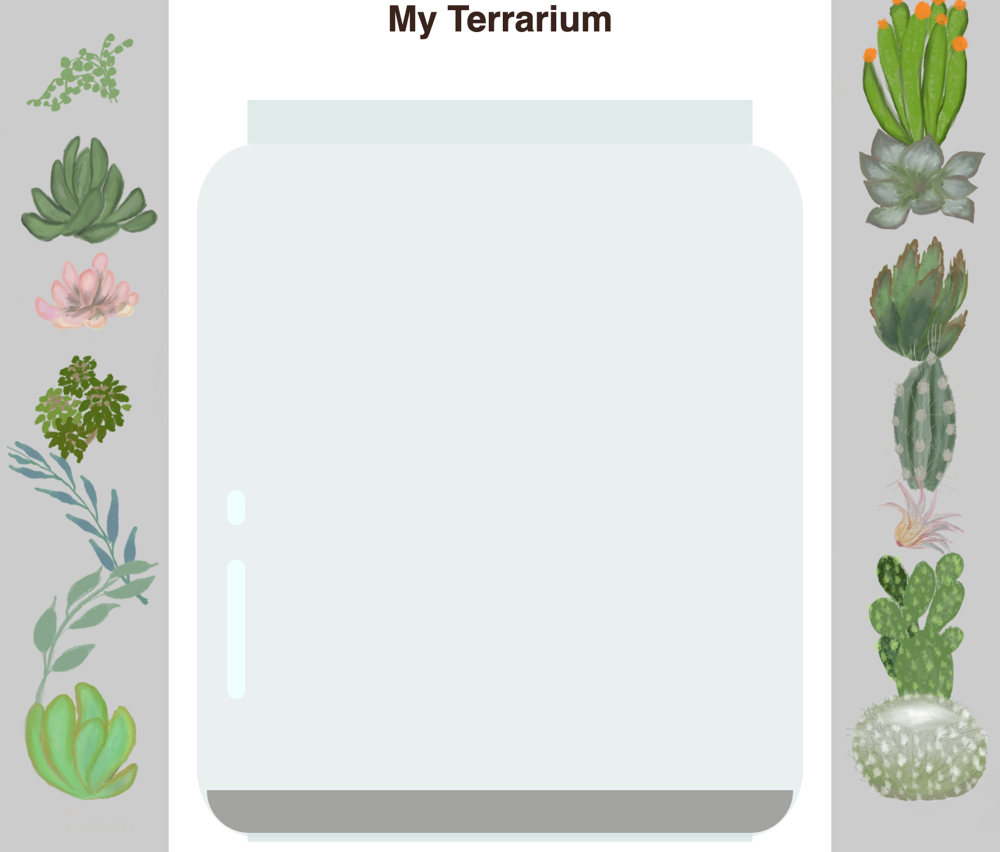

<!--
CO_OP_TRANSLATOR_METADATA:
{
  "original_hash": "e375c2aeb94e2407f2667633d39580bd",
  "translation_date": "2025-08-23T22:32:17+00:00",
  "source_file": "3-terrarium/2-intro-to-css/README.md",
  "language_code": "zh"
}
-->
# 微型生态瓶项目第二部分：CSS简介


> [Tomomi Imura](https://twitter.com/girlie_mac) 的手绘笔记

## 课前测验

[课前测验](https://ashy-river-0debb7803.1.azurestaticapps.net/quiz/17)

### 简介

CSS（层叠样式表）解决了网页开发中的一个重要问题：如何让你的网站看起来更美观。为应用程序添加样式不仅能提升用户体验，还能让页面更具吸引力。此外，CSS 还可以用来创建响应式网页设计（RWD），使你的应用在任何屏幕尺寸下都能保持良好的显示效果。CSS 不仅仅是为了让应用看起来漂亮，它的规范还包括动画和变换功能，可以为应用实现复杂的交互效果。CSS 工作组负责维护当前的 CSS 规范，你可以在 [万维网联盟网站](https://www.w3.org/Style/CSS/members) 上关注他们的工作。

> 注意，CSS 是一种不断发展的语言，就像网络上的其他技术一样，并非所有浏览器都支持最新的规范。在实现功能时，请务必参考 [CanIUse.com](https://caniuse.com) 检查兼容性。

在本课中，我们将为在线微型生态瓶添加样式，并学习多个 CSS 概念：层叠、继承、选择器的使用、定位以及如何使用 CSS 构建布局。在此过程中，我们将为微型生态瓶布局，并创建实际的生态瓶。

### 前置条件

你应该已经完成了微型生态瓶的 HTML 构建，并准备好为其添加样式。

> 查看视频

> 
> [](https://www.youtube.com/watch?v=6yIdOIV9p1I)

### 任务

在你的微型生态瓶文件夹中，创建一个名为 `style.css` 的新文件。在 `<head>` 部分中导入该文件：

```html
<link rel="stylesheet" href="./style.css" />
```

---

## 层叠

层叠样式表的核心思想是样式具有“层叠性”，即样式的应用由其优先级决定。由网站作者设置的样式优先于浏览器默认样式，而内联样式的优先级高于外部样式表中的样式。

### 任务

为你的 `<h1>` 标签添加内联样式 "color: red"：

```HTML
<h1 style="color: red">My Terrarium</h1>
```

然后，将以下代码添加到你的 `style.css` 文件中：

```CSS
h1 {
 color: blue;
}
```

✅ 你的网页应用中显示的颜色是什么？为什么？你能找到一种方法来覆盖样式吗？在什么情况下你会想要这样做，或者为什么不这样做？

---

## 继承

样式可以从祖先元素继承到后代元素，即嵌套的元素会继承其父元素的样式。

### 任务

将 body 的字体设置为某种字体，并检查嵌套元素的字体：

```CSS
body {
	font-family: helvetica, arial, sans-serif;
}
```

打开浏览器的控制台，切换到“元素”标签，观察 H1 的字体。你会发现它继承了 body 的字体，这一点在浏览器中有说明：


✅ 你能让嵌套样式继承不同的属性吗？

---

## CSS 选择器

### 标签

目前，你的 `style.css` 文件中只为少量标签设置了样式，因此应用看起来有些奇怪：

```CSS
body {
	font-family: helvetica, arial, sans-serif;
}

h1 {
	color: #3a241d;
	text-align: center;
}
```

这种为标签设置样式的方法可以控制单个元素，但如果你需要控制微型生态瓶中许多植物的样式，就需要利用 CSS 选择器。

### ID

为左侧和右侧容器添加一些样式。由于标记中只有一个左侧容器和一个右侧容器，因此它们被赋予了 ID。要为它们设置样式，可以使用 `#`：

```CSS
#left-container {
	background-color: #eee;
	width: 15%;
	left: 0px;
	top: 0px;
	position: absolute;
	height: 100%;
	padding: 10px;
}

#right-container {
	background-color: #eee;
	width: 15%;
	right: 0px;
	top: 0px;
	position: absolute;
	height: 100%;
	padding: 10px;
}
```

在这里，你通过绝对定位将这些容器放置在屏幕的最左侧和最右侧，并使用百分比设置它们的宽度，以便它们可以适配小屏幕设备。

✅ 这段代码有些重复，因此不符合“DRY”（Don't Repeat Yourself）的原则。你能找到一种更好的方法来为这些 ID 设置样式吗？也许可以结合使用 ID 和类？你需要修改标记并重构 CSS：

```html
<div id="left-container" class="container"></div>
```

### 类

在上面的例子中，你为屏幕上的两个唯一元素设置了样式。如果你希望样式应用于屏幕上的多个元素，可以使用 CSS 类。为左侧和右侧容器中的植物布局时可以这样做。

注意，HTML 标记中的每个植物都有 ID 和类的组合。这里的 ID 将在稍后添加的 JavaScript 中使用，用于操作微型生态瓶中的植物位置。而类则为所有植物提供了统一的样式。

```html
<div class="plant-holder">
	
</div>
```

将以下内容添加到你的 `style.css` 文件中：

```CSS
.plant-holder {
	position: relative;
	height: 13%;
	left: -10px;
}

.plant {
	position: absolute;
	max-width: 150%;
	max-height: 150%;
	z-index: 2;
}
```

在这段代码中，值得注意的是相对定位和绝对定位的混合使用，我们将在下一节中详细讨论。请注意高度是如何通过百分比处理的：

你将植物容器的高度设置为 13%，这是一个合适的数值，确保所有植物都能在每个垂直容器中显示，而无需滚动。

你将植物容器向左移动，使植物在容器中更居中。由于图片有大量透明背景，为了使其更易拖动，需要向左移动以更好地适配屏幕。

然后，植物本身的最大宽度设置为 150%。这使得它们可以随着浏览器的缩小而缩小。尝试调整浏览器大小，植物会保持在容器内并缩小以适配。

另一个值得注意的是 z-index 的使用，它控制元素的相对高度（使植物位于容器之上，看起来像是放置在微型生态瓶中）。

✅ 为什么需要同时使用植物容器和植物的 CSS 选择器？

## CSS 定位

混合使用定位属性（包括 static、relative、fixed、absolute 和 sticky 定位）可能有些复杂，但如果使用得当，可以很好地控制页面上的元素。

绝对定位的元素是相对于最近的已定位祖先元素进行定位的，如果没有，则相对于文档主体进行定位。

相对定位的元素是基于 CSS 指定的方向，从其初始位置调整位置。

在我们的示例中，`plant-holder` 是一个相对定位的元素，位于一个绝对定位的容器内。其结果是侧边栏容器固定在左右两侧，而 `plant-holder` 嵌套在其中，根据侧边栏调整自身位置，为植物垂直排列提供空间。

> `plant` 本身也使用了绝对定位，这是使其可拖动的必要条件，你将在下一课中了解更多。

✅ 尝试切换侧边容器和植物容器的定位类型。会发生什么？

## CSS 布局

现在，你将使用所学内容，通过 CSS 构建微型生态瓶！

首先，使用 CSS 将 `.terrarium` div 的子元素设置为圆角矩形：

```CSS
.jar-walls {
	height: 80%;
	width: 60%;
	background: #d1e1df;
	border-radius: 1rem;
	position: absolute;
	bottom: 0.5%;
	left: 20%;
	opacity: 0.5;
	z-index: 1;
}

.jar-top {
	width: 50%;
	height: 5%;
	background: #d1e1df;
	position: absolute;
	bottom: 80.5%;
	left: 25%;
	opacity: 0.7;
	z-index: 1;
}

.jar-bottom {
	width: 50%;
	height: 1%;
	background: #d1e1df;
	position: absolute;
	bottom: 0%;
	left: 25%;
	opacity: 0.7;
}

.dirt {
	width: 60%;
	height: 5%;
	background: #3a241d;
	position: absolute;
	border-radius: 0 0 1rem 1rem;
	bottom: 1%;
	left: 20%;
	opacity: 0.7;
	z-index: -1;
}
```

注意这里使用了百分比。如果缩小浏览器窗口，你会看到瓶子也会随之缩小。还要注意瓶子元素的宽度和高度百分比，以及每个元素如何绝对定位在中心并固定在视口底部。

我们还使用了 `rem` 设置圆角半径，这是一种相对于字体的长度单位。可以在 [CSS 规范](https://www.w3.org/TR/css-values-3/#font-relative-lengths) 中了解更多关于这种相对测量的方法。

✅ 尝试更改瓶子颜色和透明度与泥土的颜色和透明度。会发生什么？为什么？

---

## 🚀挑战

为瓶子的左下区域添加一个“气泡”光泽，使其看起来更像玻璃。你需要为 `.jar-glossy-long` 和 `.jar-glossy-short` 设置样式，使其看起来像反射的光泽。效果如下：



完成课后测验，请学习以下模块：[使用 CSS 为 HTML 应用添加样式](https://docs.microsoft.com/learn/modules/build-simple-website/4-css-basics/?WT.mc_id=academic-77807-sagibbon)

## 课后测验

[课后测验](https://ashy-river-0debb7803.1.azurestaticapps.net/quiz/18)

## 复习与自学

CSS 看似简单，但要为所有浏览器和屏幕尺寸完美地设置样式却充满挑战。CSS-Grid 和 Flexbox 是为使工作更有结构性和可靠性而开发的工具。通过玩 [Flexbox Froggy](https://flexboxfroggy.com/) 和 [Grid Garden](https://codepip.com/games/grid-garden/) 来学习这些工具。

## 作业

[CSS 重构](assignment.md)

**免责声明**：  
本文档使用AI翻译服务 [Co-op Translator](https://github.com/Azure/co-op-translator) 进行翻译。尽管我们努力确保翻译的准确性，但请注意，自动翻译可能包含错误或不准确之处。应以原始语言的文档作为权威来源。对于重要信息，建议使用专业人工翻译。我们不对因使用此翻译而产生的任何误解或误读承担责任。