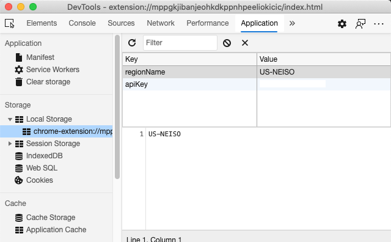

<!--
CO_OP_TRANSLATOR_METADATA:
{
  "original_hash": "e10f168beac4e7b05e30e0eb5c92bf11",
  "translation_date": "2025-08-23T23:38:01+00:00",
  "source_file": "5-browser-extension/2-forms-browsers-local-storage/README.md",
  "language_code": "zh"
}
-->
# 浏览器扩展项目第2部分：调用API，使用本地存储

## 课前测验

[课前测验](https://ashy-river-0debb7803.1.azurestaticapps.net/quiz/25)

### 介绍

在本课中，你将通过提交浏览器扩展的表单来调用API，并在浏览器扩展中显示结果。此外，你还将学习如何将数据存储在浏览器的本地存储中，以便将来参考和使用。

✅ 按照适当文件中的编号段落，了解代码应放置的位置。

### 设置扩展中需要操作的元素：

到目前为止，你已经为浏览器扩展构建了表单和结果 `<div>` 的HTML。从现在开始，你需要在 `/src/index.js` 文件中工作，并逐步构建你的扩展。参考[上一课](../1-about-browsers/README.md)了解如何设置项目和构建流程。

在 `index.js` 文件中工作，首先创建一些 `const` 变量来保存与各个字段相关的值：

```JavaScript
// form fields
const form = document.querySelector('.form-data');
const region = document.querySelector('.region-name');
const apiKey = document.querySelector('.api-key');

// results
const errors = document.querySelector('.errors');
const loading = document.querySelector('.loading');
const results = document.querySelector('.result-container');
const usage = document.querySelector('.carbon-usage');
const fossilfuel = document.querySelector('.fossil-fuel');
const myregion = document.querySelector('.my-region');
const clearBtn = document.querySelector('.clear-btn');
```

所有这些字段都是通过它们的CSS类引用的，这是你在上一课的HTML中设置的。

### 添加监听器

接下来，为表单和重置按钮添加事件监听器，这样当用户提交表单或点击重置按钮时，会触发相应的操作，并在文件底部添加初始化应用的调用：

```JavaScript
form.addEventListener('submit', (e) => handleSubmit(e));
clearBtn.addEventListener('click', (e) => reset(e));
init();
```

✅ 注意这里使用的简写方式来监听提交或点击事件，以及事件如何传递给 handleSubmit 或 reset 函数。你能用更长的格式写出这个简写的等价代码吗？你更喜欢哪种方式？

### 构建 init() 函数和 reset() 函数：

现在你将构建初始化扩展的函数，即 init()：

```JavaScript
function init() {
	//if anything is in localStorage, pick it up
	const storedApiKey = localStorage.getItem('apiKey');
	const storedRegion = localStorage.getItem('regionName');

	//set icon to be generic green
	//todo

	if (storedApiKey === null || storedRegion === null) {
		//if we don't have the keys, show the form
		form.style.display = 'block';
		results.style.display = 'none';
		loading.style.display = 'none';
		clearBtn.style.display = 'none';
		errors.textContent = '';
	} else {
        //if we have saved keys/regions in localStorage, show results when they load
        displayCarbonUsage(storedApiKey, storedRegion);
		results.style.display = 'none';
		form.style.display = 'none';
		clearBtn.style.display = 'block';
	}
};

function reset(e) {
	e.preventDefault();
	//clear local storage for region only
	localStorage.removeItem('regionName');
	init();
}

```

在这个函数中，有一些有趣的逻辑。阅读代码后，你能看出发生了什么吗？

- 设置两个 `const` 来检查用户是否在本地存储中保存了 APIKey 和区域代码。
- 如果其中任何一个为 null，通过将表单的样式更改为 'block' 来显示表单。
- 隐藏结果、加载状态和 clearBtn，并将任何错误文本设置为空字符串。
- 如果存在 key 和 region，则启动一个流程：
  - 调用API获取碳使用数据。
  - 隐藏结果区域。
  - 隐藏表单。
  - 显示重置按钮。

在继续之前，了解浏览器中一个非常重要的概念是很有用的：[LocalStorage](https://developer.mozilla.org/docs/Web/API/Window/localStorage)。LocalStorage 是一种以 `key-value` 对的形式在浏览器中存储字符串的有用方式。这种类型的Web存储可以通过JavaScript操作来管理浏览器中的数据。LocalStorage 不会过期，而另一种Web存储 SessionStorage 会在浏览器关闭时清除。这些存储类型在使用上各有优缺点。

> 注意 - 你的浏览器扩展有自己的本地存储；主浏览器窗口是一个不同的实例，行为是独立的。

你可以将 APIKey 设置为一个字符串值，例如，你可以通过“检查”网页（右键单击浏览器以检查）并转到 Applications 选项卡查看存储内容，来查看它在 Edge 中的设置。



✅ 思考哪些情况下你不应该将某些数据存储在 LocalStorage 中。通常，将 API Key 放在 LocalStorage 中是一个坏主意！你能明白为什么吗？在我们的案例中，由于我们的应用仅用于学习，不会部署到应用商店，因此我们将使用这种方法。

注意，你使用 Web API 来操作 LocalStorage，可以通过 `getItem()`、`setItem()` 或 `removeItem()` 来实现。它在各大浏览器中都得到了广泛支持。

在构建 `displayCarbonUsage()` 函数（在 `init()` 中调用）之前，让我们先构建处理初始表单提交的功能。

### 处理表单提交

创建一个名为 `handleSubmit` 的函数，该函数接受一个事件参数 `(e)`。阻止事件传播（在本例中，我们希望阻止浏览器刷新）并调用一个新函数 `setUpUser`，传入参数 `apiKey.value` 和 `region.value`。通过这种方式，你可以使用通过初始表单填充的两个值。

```JavaScript
function handleSubmit(e) {
	e.preventDefault();
	setUpUser(apiKey.value, region.value);
}
```

✅ 回顾一下 - 你在上一课中设置的HTML有两个输入字段，其 `values` 是通过你在文件顶部设置的 `const` 捕获的，并且它们都是 `required` 的，因此浏览器会阻止用户输入空值。

### 设置用户

接下来是 `setUpUser` 函数，这里你将为 apiKey 和 regionName 设置本地存储值。添加一个新函数：

```JavaScript
function setUpUser(apiKey, regionName) {
	localStorage.setItem('apiKey', apiKey);
	localStorage.setItem('regionName', regionName);
	loading.style.display = 'block';
	errors.textContent = '';
	clearBtn.style.display = 'block';
	//make initial call
	displayCarbonUsage(apiKey, regionName);
}
```

此函数在调用API时显示加载消息。到此为止，你已经到达了创建此浏览器扩展最重要功能的阶段！

### 显示碳使用情况

最后，是时候查询API了！

在进一步操作之前，我们应该讨论一下API。API，即[应用程序编程接口](https://www.webopedia.com/TERM/A/API.html)，是Web开发人员工具箱中的关键元素。它们为程序之间的交互和接口提供了标准方式。例如，如果你正在构建一个需要查询数据库的网站，可能有人已经为你创建了一个API。虽然有许多类型的API，但最流行的一种是[REST API](https://www.smashingmagazine.com/2018/01/understanding-using-rest-api/)。

✅ “REST” 代表“表述性状态转移”，其特点是使用各种配置的URL来获取数据。研究一下开发人员可用的各种类型的API。哪种格式最吸引你？

关于此函数，有几点需要注意。首先，注意 [`async` 关键字](https://developer.mozilla.org/docs/Web/JavaScript/Reference/Statements/async_function)。将函数编写为异步运行意味着它会等待某个操作（例如数据返回）完成后再继续。

这里有一个关于 `async` 的简短视频：

[](https://youtube.com/watch?v=YwmlRkrxvkk "管理Promise的Async和Await")

> 🎥 点击上方图片观看关于 async/await 的视频。

创建一个新函数来查询 C02Signal API：

```JavaScript
import axios from '../node_modules/axios';

async function displayCarbonUsage(apiKey, region) {
	try {
		await axios
			.get('https://api.co2signal.com/v1/latest', {
				params: {
					countryCode: region,
				},
				headers: {
					'auth-token': apiKey,
				},
			})
			.then((response) => {
				let CO2 = Math.floor(response.data.data.carbonIntensity);

				//calculateColor(CO2);

				loading.style.display = 'none';
				form.style.display = 'none';
				myregion.textContent = region;
				usage.textContent =
					Math.round(response.data.data.carbonIntensity) + ' grams (grams C02 emitted per kilowatt hour)';
				fossilfuel.textContent =
					response.data.data.fossilFuelPercentage.toFixed(2) +
					'% (percentage of fossil fuels used to generate electricity)';
				results.style.display = 'block';
			});
	} catch (error) {
		console.log(error);
		loading.style.display = 'none';
		results.style.display = 'none';
		errors.textContent = 'Sorry, we have no data for the region you have requested.';
	}
}
```

这是一个较大的函数。这里发生了什么？

- 遵循最佳实践，你使用了 `async` 关键字使此函数异步运行。该函数包含一个 `try/catch` 块，因为当API返回数据时，它会返回一个Promise。由于你无法控制API响应的速度（它可能根本不响应！），你需要通过异步调用来处理这种不确定性。
- 你正在查询 co2signal API 以获取你所在区域的数据，使用你的 API Key。要使用该密钥，你需要在请求头参数中使用一种身份验证方式。
- 一旦API响应，你将其响应数据的各个元素分配给你设置的屏幕部分以显示这些数据。
- 如果出现错误，或者没有结果，你会显示一条错误消息。

✅ 使用异步编程模式是工具箱中另一个非常有用的工具。阅读[关于配置此类代码的各种方式](https://developer.mozilla.org/docs/Web/JavaScript/Reference/Statements/async_function)。

恭喜！如果你构建了扩展（`npm run build`）并在扩展面板中刷新它，你就有了一个可用的扩展！唯一未完成的是图标，你将在下一课中修复它。

---

## 🚀 挑战

在这些课程中，我们已经讨论了几种类型的API。选择一个Web API，深入研究它提供的功能。例如，查看浏览器中可用的API，如[HTML拖放API](https://developer.mozilla.org/docs/Web/API/HTML_Drag_and_Drop_API)。在你看来，什么样的API是优秀的？

## 课后测验

[课后测验](https://ashy-river-0debb7803.1.azurestaticapps.net/quiz/26)

## 复习与自学

在本课中，你学习了 LocalStorage 和 API，这两者对专业的Web开发人员都非常有用。你能想到这两者如何协同工作吗？思考一下如何设计一个网站，将项目存储起来以供API使用。

## 作业

[采用一个API](assignment.md)

**免责声明**：  
本文档使用AI翻译服务 [Co-op Translator](https://github.com/Azure/co-op-translator) 进行翻译。尽管我们努力确保翻译的准确性，但请注意，自动翻译可能包含错误或不准确之处。应以原始语言的文档作为权威来源。对于关键信息，建议使用专业人工翻译。因使用本翻译而引起的任何误解或误读，我们概不负责。