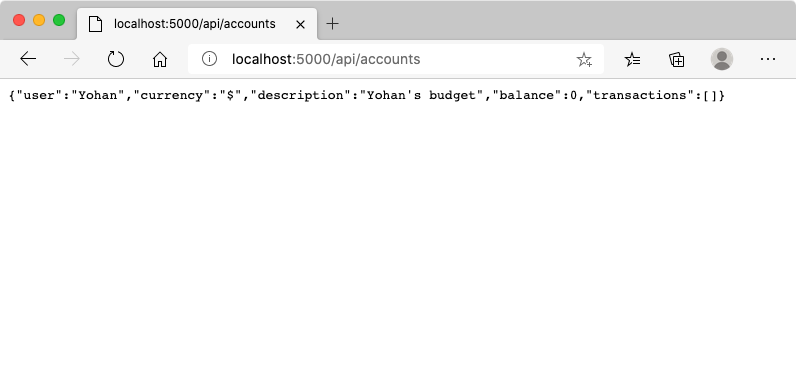

<!--
CO_OP_TRANSLATOR_METADATA:
{
  "original_hash": "b667b7d601e2ee19acb5aa9d102dc9f3",
  "translation_date": "2025-08-23T23:56:11+00:00",
  "source_file": "7-bank-project/2-forms/README.md",
  "language_code": "zh"
}
-->
# 构建银行应用程序第2部分：创建登录和注册表单

## 课前测验

[课前测验](https://ashy-river-0debb7803.1.azurestaticapps.net/quiz/43)

### 简介

在几乎所有现代的网络应用中，用户都可以创建一个账户来拥有自己的私人空间。由于多个用户可以同时访问一个网络应用，因此需要一种机制来分别存储每个用户的个人数据，并选择显示哪些信息。我们不会深入探讨如何[安全地管理用户身份](https://en.wikipedia.org/wiki/Authentication)，因为这是一个非常广泛的话题，但我们会确保每个用户能够在我们的应用中创建一个（或多个）银行账户。

在这一部分，我们将使用HTML表单为我们的网络应用添加登录和注册功能。我们将学习如何以编程方式将数据发送到服务器API，并最终定义用户输入的基本验证规则。

### 前置条件

你需要完成本课的[HTML模板和路由](../1-template-route/README.md)部分。此外，你需要安装[Node.js](https://nodejs.org)并[在本地运行服务器API](../api/README.md)，以便能够发送数据来创建账户。

**注意事项**  
你需要同时运行两个终端，如下所示：  
1. 用于我们在[HTML模板和路由](../1-template-route/README.md)课程中构建的主银行应用程序。  
2. 用于我们刚刚设置的[银行应用服务器API](../api/README.md)。  

要完成本课程的其余部分，这两个服务器都需要正常运行。它们监听不同的端口（端口`3000`和端口`5000`），因此一切应该可以正常工作。

你可以通过在终端中执行以下命令来测试服务器是否正常运行：

```sh
curl http://localhost:5000/api
# -> should return "Bank API v1.0.0" as a result
```

---

## 表单和控件

`<form>`元素封装了HTML文档的一部分，用户可以通过交互式控件输入和提交数据。在表单中可以使用各种用户界面（UI）控件，其中最常见的是`<input>`和`<button>`元素。

`<input>`有许多不同的[类型](https://developer.mozilla.org/docs/Web/HTML/Element/input)，例如，要创建一个供用户输入用户名的字段，可以使用：

```html
<input id="username" name="username" type="text">
```

`name`属性将在表单数据发送时用作属性名。`id`属性用于将`<label>`与表单控件关联。

> 查看[`<input>`类型](https://developer.mozilla.org/docs/Web/HTML/Element/input)和[其他表单控件](https://developer.mozilla.org/docs/Learn/Forms/Other_form_controls)的完整列表，了解构建UI时可以使用的所有原生UI元素。

✅ 注意，`<input>`是一个[空元素](https://developer.mozilla.org/docs/Glossary/Empty_element)，不应添加匹配的关闭标签。不过，你可以使用自闭合的`<input/>`表示法，但这不是必须的。

表单中的`<button>`元素有点特殊。如果未指定其`type`属性，当按下按钮时，它会自动将表单数据提交到服务器。以下是可能的`type`值：

- `submit`：表单中的默认值，按钮触发表单提交操作。
- `reset`：按钮将所有表单控件重置为初始值。
- `button`：按钮按下时不分配默认行为。可以使用JavaScript为其分配自定义操作。

### 任务

让我们从在`login`模板中添加一个表单开始。我们需要一个*用户名*字段和一个*登录*按钮。

```html
<template id="login">
  <h1>Bank App</h1>
  <section>
    <h2>Login</h2>
    <form id="loginForm">
      <label for="username">Username</label>
      <input id="username" name="user" type="text">
      <button>Login</button>
    </form>
  </section>
</template>
```

如果仔细观察，你会注意到我们还添加了一个`<label>`元素。`<label>`元素用于为UI控件添加名称，例如我们的用户名字段。标签对于表单的可读性非常重要，同时还带来以下额外好处：

- 通过将标签与表单控件关联，可以帮助使用辅助技术（如屏幕阅读器）的用户理解需要提供哪些数据。
- 你可以点击标签直接将焦点放在关联的输入框上，这使得在触摸屏设备上更容易操作。

> [网络无障碍性](https://developer.mozilla.org/docs/Learn/Accessibility/What_is_accessibility)是一个非常重要但经常被忽视的话题。得益于[语义化HTML元素](https://developer.mozilla.org/docs/Learn/Accessibility/HTML)，如果正确使用它们，创建无障碍内容并不困难。你可以[阅读更多关于无障碍性的内容](https://developer.mozilla.org/docs/Web/Accessibility)，以避免常见错误并成为一名负责任的开发者。

现在我们将在前一个表单的下方添加第二个注册表单：

```html
<hr/>
<h2>Register</h2>
<form id="registerForm">
  <label for="user">Username</label>
  <input id="user" name="user" type="text">
  <label for="currency">Currency</label>
  <input id="currency" name="currency" type="text" value="$">
  <label for="description">Description</label>
  <input id="description" name="description" type="text">
  <label for="balance">Current balance</label>
  <input id="balance" name="balance" type="number" value="0">
  <button>Register</button>
</form>
```

通过使用`value`属性，我们可以为给定的输入框定义默认值。  
还请注意，`balance`的输入框类型为`number`。它看起来是否与其他输入框不同？试着与它交互一下。

✅ 你能仅使用键盘导航和操作这些表单吗？你会怎么做？

## 向服务器提交数据

现在我们有了一个功能性的UI，下一步是将数据发送到服务器。让我们用当前的代码做一个快速测试：点击*登录*或*注册*按钮会发生什么？

你是否注意到浏览器URL部分的变化？


`<form>`的默认行为是使用[GET方法](https://www.w3.org/Protocols/rfc2616/rfc2616-sec9.html#sec9.3)将表单提交到当前服务器URL，并将表单数据直接附加到URL。这种方法有一些缺点：

- 发送的数据大小非常有限（大约2000个字符）。
- 数据直接显示在URL中（对密码来说不太好）。
- 不支持文件上传。

因此，你可以将其更改为使用[POST方法](https://www.w3.org/Protocols/rfc2616/rfc2616-sec9.html#sec9.5)，它将表单数据发送到HTTP请求的正文中，而没有上述限制。

> 虽然POST是发送数据最常用的方法，但[在某些特定场景下](https://www.w3.org/2001/tag/doc/whenToUseGet.html)，例如实现搜索字段时，使用GET方法更为合适。

### 任务

为注册表单添加`action`和`method`属性：

```html
<form id="registerForm" action="//localhost:5000/api/accounts" method="POST">
```

现在尝试用你的名字注册一个新账户。点击*注册*按钮后，你应该会看到如下内容：



如果一切正常，服务器应该会以包含创建的账户数据的[JSON](https://www.json.org/json-en.html)响应来回答你的请求。

✅ 再次用相同的名字尝试注册。会发生什么？

## 无需刷新页面提交数据

你可能已经注意到，我们刚刚使用的方法有一个小问题：提交表单时，我们离开了应用，浏览器重定向到服务器URL。我们正在尝试避免所有页面刷新，因为我们正在构建一个[单页应用程序（SPA）](https://en.wikipedia.org/wiki/Single-page_application)。

要在不强制页面刷新的情况下将表单数据发送到服务器，我们需要使用JavaScript代码。与其在`<form>`元素的`action`属性中放置一个URL，你可以使用任何以`javascript:`字符串开头的JavaScript代码来执行自定义操作。这也意味着你需要实现一些浏览器之前自动完成的任务：

- 获取表单数据
- 将表单数据转换并编码为合适的格式
- 创建HTTP请求并将其发送到服务器

### 任务

将注册表单的`action`替换为：

```html
<form id="registerForm" action="javascript:register()">
```

打开`app.js`，添加一个名为`register`的新函数：

```js
function register() {
  const registerForm = document.getElementById('registerForm');
  const formData = new FormData(registerForm);
  const data = Object.fromEntries(formData);
  const jsonData = JSON.stringify(data);
}
```

在这里，我们使用`getElementById()`获取表单元素，并使用[`FormData`](https://developer.mozilla.org/docs/Web/API/FormData)助手将表单控件的值提取为一组键/值对。然后，我们使用[`Object.fromEntries()`](https://developer.mozilla.org/docs/Web/JavaScript/Reference/Global_Objects/Object/fromEntries)将数据转换为常规对象，最后将数据序列化为[JSON](https://www.json.org/json-en.html)，这是一种网络上常用的数据交换格式。

数据现在已准备好发送到服务器。创建一个名为`createAccount`的新函数：

```js
async function createAccount(account) {
  try {
    const response = await fetch('//localhost:5000/api/accounts', {
      method: 'POST',
      headers: { 'Content-Type': 'application/json' },
      body: account
    });
    return await response.json();
  } catch (error) {
    return { error: error.message || 'Unknown error' };
  }
}
```

这个函数在做什么？首先，注意这里的`async`关键字。这意味着函数包含将以[**异步**](https://developer.mozilla.org/docs/Web/JavaScript/Reference/Statements/async_function)方式执行的代码。当与`await`关键字一起使用时，它允许等待异步代码执行（例如等待服务器响应）后再继续。

以下是关于`async/await`用法的简短视频：

[](https://youtube.com/watch?v=YwmlRkrxvkk "管理Promise的Async和Await")

> 🎥 点击上方图片观看关于async/await的视频。

我们使用`fetch()`API将JSON数据发送到服务器。此方法需要两个参数：

- 服务器的URL，因此我们在这里放回`//localhost:5000/api/accounts`。
- 请求的设置。在这里我们将方法设置为`POST`并提供请求的`body`。由于我们将JSON数据发送到服务器，还需要将`Content-Type`头设置为`application/json`，以便服务器知道如何解释内容。

由于服务器会以JSON响应请求，我们可以使用`await response.json()`解析JSON内容并返回结果对象。请注意，此方法是异步的，因此我们在返回之前使用`await`关键字以确保在解析期间的任何错误也会被捕获。

现在在`register`函数中添加一些代码以调用`createAccount()`：

```js
const result = await createAccount(jsonData);
```

因为我们在这里使用了`await`关键字，所以需要在register函数前添加`async`关键字：

```js
async function register() {
```

最后，让我们添加一些日志来检查结果。最终函数应如下所示：

```js
async function register() {
  const registerForm = document.getElementById('registerForm');
  const formData = new FormData(registerForm);
  const jsonData = JSON.stringify(Object.fromEntries(formData));
  const result = await createAccount(jsonData);

  if (result.error) {
    return console.log('An error occurred:', result.error);
  }

  console.log('Account created!', result);
}
```

虽然过程有点长，但我们完成了！如果你打开[浏览器开发者工具](https://developer.mozilla.org/docs/Learn/Common_questions/What_are_browser_developer_tools)，并尝试注册一个新账户，你应该不会看到网页有任何变化，但控制台中会出现一条消息，确认一切正常。


✅ 你认为数据是安全地发送到服务器的吗？如果有人能够拦截请求会怎样？你可以阅读[HTTPS](https://en.wikipedia.org/wiki/HTTPS)以了解更多关于安全数据通信的内容。

## 数据验证

如果你尝试在未设置用户名的情况下注册新账户，可以看到服务器返回了一个状态码为[400（错误请求）](https://developer.mozilla.org/docs/Web/HTTP/Status/400#:~:text=The%20HyperText%20Transfer%20Protocol%20(HTTP,%2C%20or%20deceptive%20request%20routing).)的错误。

在将数据发送到服务器之前，最好先[验证表单数据](https://developer.mozilla.org/docs/Learn/Forms/Form_validation)，以确保发送的是有效请求。HTML5表单控件通过各种属性提供了内置验证功能：

- `required`：字段必须填写，否则表单无法提交。
- `minlength`和`maxlength`：定义文本字段的最小和最大字符数。
- `min`和`max`：定义数值字段的最小值和最大值。
- `type`：定义期望的数据类型，例如`number`、`email`、`file`或[其他内置类型](https://developer.mozilla.org/docs/Web/HTML/Element/input)。此属性还可能更改表单控件的视觉呈现。
- `pattern`：允许定义一个[正则表达式](https://developer.mozilla.org/docs/Web/JavaScript/Guide/Regular_Expressions)模式，以测试输入的数据是否有效。
提示：您可以使用 `:valid` 和 `:invalid` CSS 伪类，根据表单控件是否有效来自定义其外观。
### 任务

创建一个有效的新账户需要填写两个必填字段：用户名和货币，其他字段为可选项。更新表单的 HTML，使用 `required` 属性以及字段标签中的文字来实现：

```html
<label for="user">Username (required)</label>
<input id="user" name="user" type="text" required>
...
<label for="currency">Currency (required)</label>
<input id="currency" name="currency" type="text" value="$" required>
```

虽然当前的服务器实现并未对字段的最大长度设置具体限制，但为用户输入的文本定义合理的长度限制始终是一个良好的实践。

为文本字段添加 `maxlength` 属性：

```html
<input id="user" name="user" type="text" maxlength="20" required>
...
<input id="currency" name="currency" type="text" value="$" maxlength="5" required>
...
<input id="description" name="description" type="text" maxlength="100">
```

现在，如果你按下 *注册* 按钮，而某个字段未遵守我们定义的验证规则，你应该会看到类似这样的提示：


这种在发送数据到服务器之前进行的验证称为**客户端验证**。但需要注意的是，并非所有检查都可以在不发送数据的情况下完成。例如，我们无法在这里检查是否已经存在一个相同用户名的账户，而不向服务器发送请求。在服务器上进行的额外验证称为**服务器端验证**。

通常两种验证都需要实现。客户端验证通过向用户提供即时反馈来改善用户体验，而服务器端验证则至关重要，确保你处理的用户数据是可靠且安全的。

---

## 🚀 挑战

在 HTML 中显示一个错误信息，提示用户账户已存在。

以下是经过一些样式调整后的最终登录页面示例：


## 课后测验

[课后测验](https://ashy-river-0debb7803.1.azurestaticapps.net/quiz/44)

## 复习与自学

开发者在构建表单方面变得非常有创意，尤其是在验证策略方面。通过浏览 [CodePen](https://codepen.com) 来了解不同的表单流程；你能找到一些有趣且富有启发性的表单吗？

## 作业

[为你的银行应用设计样式](assignment.md)

**免责声明**：  
本文档使用AI翻译服务 [Co-op Translator](https://github.com/Azure/co-op-translator) 进行翻译。尽管我们努力确保翻译的准确性，但请注意，自动翻译可能包含错误或不准确之处。应以原始语言的文档作为权威来源。对于关键信息，建议使用专业人工翻译。因使用本翻译而引起的任何误解或误读，我们概不负责。