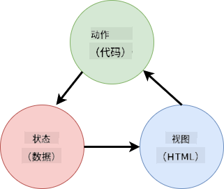
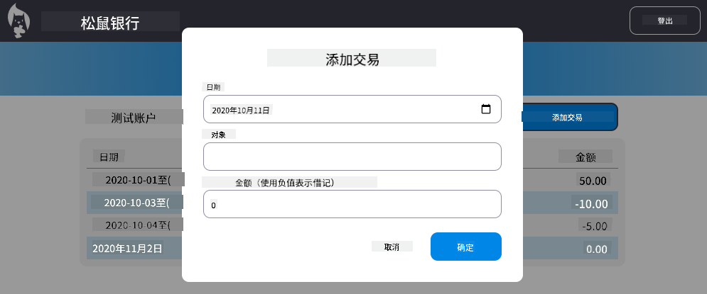

<!--
CO_OP_TRANSLATOR_METADATA:
{
  "original_hash": "5d2efabbc8f94d89f4317ee8646c3ce9",
  "translation_date": "2025-08-29T14:42:40+00:00",
  "source_file": "7-bank-project/4-state-management/README.md",
  "language_code": "zh"
}
-->
# 构建银行应用程序第4部分：状态管理概念

## 课前测验

[课前测验](https://ff-quizzes.netlify.app/web/quiz/47)

### 简介

随着一个网络应用程序的规模不断扩大，管理数据流变得越来越具有挑战性。哪些代码获取了数据，哪些页面使用了数据，数据需要在何时何地更新……很容易导致代码混乱，难以维护。尤其是当你需要在应用程序的不同页面之间共享数据时，比如用户数据。*状态管理*的概念一直存在于各种程序中，但随着网络应用的复杂性不断增加，它现在成为开发过程中需要重点考虑的问题。

在最后这一部分中，我们将重新审视我们构建的应用程序，重新思考如何管理状态，以支持浏览器在任何时候刷新，并在用户会话之间持久化数据。

### 前置条件

你需要完成本课程的[数据获取](../3-data/README.md)部分。你还需要安装 [Node.js](https://nodejs.org) 并[本地运行服务器 API](../api/README.md)，以便管理账户数据。

你可以通过在终端中执行以下命令来测试服务器是否正常运行：

```sh
curl http://localhost:5000/api
# -> should return "Bank API v1.0.0" as a result
```

---

## 重新思考状态管理

在[上一课](../3-data/README.md)中，我们在应用程序中引入了一个基本的状态概念，即全局变量 `account`，它包含当前登录用户的银行数据。然而，我们当前的实现存在一些问题。试着在仪表板页面刷新一下，看看会发生什么？

当前代码存在以下三个问题：

- 状态没有持久化，浏览器刷新会将你带回登录页面。
- 有多个函数修改状态。随着应用程序的增长，这会使跟踪状态变化变得困难，并且容易忘记更新某些部分。
- 状态没有清理，因此当你点击*注销*时，账户数据仍然存在，即使你已经回到登录页面。

我们可以逐一更新代码来解决这些问题，但这会导致代码重复增加，使应用程序更加复杂且难以维护。或者，我们可以暂停几分钟，重新思考我们的策略。

> 我们真正试图解决的问题是什么？

[状态管理](https://en.wikipedia.org/wiki/State_management)的核心是找到一个好的方法来解决以下两个问题：

- 如何让应用程序中的数据流易于理解？
- 如何确保状态数据始终与用户界面保持同步（反之亦然）？

一旦解决了这些问题，你可能会发现其他问题要么已经解决，要么变得更容易解决。有许多方法可以解决这些问题，但我们将采用一种常见的解决方案，即**集中管理数据及其修改方式**。数据流将如下图所示：



> 我们在这里不会讨论数据自动触发视图更新的部分，因为它涉及到更高级的[响应式编程](https://en.wikipedia.org/wiki/Reactive_programming)概念。如果你有兴趣深入研究，这是一个很好的后续主题。

✅ 市面上有许多不同方法的状态管理库，[Redux](https://redux.js.org) 是一个流行的选择。了解其使用的概念和模式通常是学习如何解决大型网络应用中潜在问题的好方法。

### 任务

我们将从一些代码重构开始。替换 `account` 声明：

```js
let account = null;
```

为：

```js
let state = {
  account: null
};
```

我们的想法是将应用程序的所有数据集中到一个单一的状态对象中。目前状态中只有 `account`，因此变化不大，但这为未来的扩展铺平了道路。

我们还需要更新使用它的函数。在 `register()` 和 `login()` 函数中，将 `account = ...` 替换为 `state.account = ...`;

在 `updateDashboard()` 函数的顶部，添加以下代码：

```js
const account = state.account;
```

这次重构本身并没有带来太多改进，但目的是为接下来的更改奠定基础。

## 跟踪数据变化

现在我们已经设置了 `state` 对象来存储数据，下一步是集中更新。目标是让跟踪任何变化及其发生时间变得更容易。

为了避免对 `state` 对象进行直接修改，考虑将其视为[*不可变对象*](https://en.wikipedia.org/wiki/Immutable_object)是一个好习惯，这意味着它不能被修改。这也意味着如果你想更改其中的任何内容，必须创建一个新的状态对象。通过这样做，你可以防止潜在的[副作用](https://en.wikipedia.org/wiki/Side_effect_(computer_science))，并为应用程序的新功能（如实现撤销/重做）打开可能性，同时也使调试更容易。例如，你可以记录对状态所做的每次更改，并保留更改历史记录，以便了解错误的来源。

在 JavaScript 中，你可以使用 [`Object.freeze()`](https://developer.mozilla.org/docs/Web/JavaScript/Reference/Global_Objects/Object/freeze) 创建对象的不可变版本。如果尝试修改不可变对象，将会抛出异常。

✅ 你知道*浅不可变对象*和*深不可变对象*的区别吗？你可以在[这里](https://developer.mozilla.org/docs/Web/JavaScript/Reference/Global_Objects/Object/freeze#What_is_shallow_freeze)阅读相关内容。

### 任务

让我们创建一个新的 `updateState()` 函数：

```js
function updateState(property, newData) {
  state = Object.freeze({
    ...state,
    [property]: newData
  });
}
```

在这个函数中，我们创建了一个新的状态对象，并使用[*扩展运算符 (`...`)*](https://developer.mozilla.org/docs/Web/JavaScript/Reference/Operators/Spread_syntax#Spread_in_object_literals)从之前的状态中复制数据。然后我们使用[方括号表示法](https://developer.mozilla.org/docs/Web/JavaScript/Guide/Working_with_Objects#Objects_and_properties) `[property]` 为赋值覆盖状态对象的特定属性。最后，我们使用 `Object.freeze()` 锁定对象以防止修改。目前状态中只有 `account` 属性，但通过这种方法，你可以在状态中添加任意多的属性。

我们还需要更新 `state` 的初始化，以确保初始状态也是冻结的：

```js
let state = Object.freeze({
  account: null
});
```

之后，更新 `register` 函数，将 `state.account = result;` 替换为：

```js
updateState('account', result);
```

对 `login` 函数进行同样的操作，将 `state.account = data;` 替换为：

```js
updateState('account', data);
```

我们现在可以顺便修复用户点击*注销*时账户数据未清除的问题。

创建一个新的函数 `logout()`：

```js
function logout() {
  updateState('account', null);
  navigate('/login');
}
```

在 `updateDashboard()` 中，将重定向 `return navigate('/login');` 替换为 `return logout();`

尝试注册一个新账户，注销并重新登录，检查是否一切正常。

> 提示：你可以通过在 `updateState()` 的底部添加 `console.log(state)` 并打开浏览器开发工具中的控制台来查看所有状态变化。

## 持久化状态

大多数网络应用程序需要持久化数据才能正常工作。所有关键数据通常存储在数据库中，并通过服务器 API 访问，例如我们的用户账户数据。但有时，为了更好的用户体验或提高加载性能，在运行于浏览器的客户端应用程序中持久化一些数据也是很有意义的。

当你想在浏览器中持久化数据时，有几个重要问题需要问自己：

- *数据是否敏感？* 你应该避免在客户端存储任何敏感数据，例如用户密码。
- *你需要保存这些数据多久？* 你是只打算在当前会话中访问这些数据，还是希望它永久保存？

根据你的目标，有多种方法可以在网络应用中存储信息。例如，你可以使用 URL 存储搜索查询，并使其在用户之间共享。你还可以使用 [HTTP cookies](https://developer.mozilla.org/docs/Web/HTTP/Cookies)，如果数据需要与服务器共享，比如[身份验证](https://en.wikipedia.org/wiki/Authentication)信息。

另一个选项是使用众多浏览器 API 中的一个来存储数据。其中两个特别有趣：

- [`localStorage`](https://developer.mozilla.org/docs/Web/API/Window/localStorage)：一个[键值存储](https://en.wikipedia.org/wiki/Key%E2%80%93value_database)，允许跨不同会话持久化特定于当前网站的数据。存储在其中的数据永不过期。
- [`sessionStorage`](https://developer.mozilla.org/docs/Web/API/Window/sessionStorage)：它的工作方式与 `localStorage` 相同，但存储在其中的数据会在会话结束时（浏览器关闭时）被清除。

注意，这两个 API 仅允许存储[字符串](https://developer.mozilla.org/docs/Web/JavaScript/Reference/Global_Objects/String)。如果你想存储复杂对象，需要使用 [`JSON.stringify()`](https://developer.mozilla.org/docs/Web/JavaScript/Reference/Global_Objects/JSON/stringify) 将其序列化为 [JSON](https://developer.mozilla.org/docs/Web/JavaScript/Reference/Global_Objects/JSON) 格式。

✅ 如果你想创建一个不依赖服务器的网络应用程序，也可以使用 [`IndexedDB` API](https://developer.mozilla.org/docs/Web/API/IndexedDB_API) 在客户端创建数据库。这适用于高级用例或需要存储大量数据的情况，因为它使用起来更复杂。

### 任务

我们希望用户在明确点击*注销*按钮之前保持登录状态，因此我们将使用 `localStorage` 存储账户数据。首先，定义一个用于存储数据的键。

```js
const storageKey = 'savedAccount';
```

然后在 `updateState()` 函数的末尾添加以下代码：

```js
localStorage.setItem(storageKey, JSON.stringify(state.account));
```

通过这样做，用户账户数据将被持久化并始终保持最新状态，因为我们之前已经集中管理了所有状态更新。这是我们开始从之前的重构中受益的地方 🙂。

由于数据已保存，我们还需要在应用程序加载时恢复它。由于我们将开始拥有更多的初始化代码，创建一个新的 `init` 函数可能是个好主意，同时包括之前在 `app.js` 底部的代码：

```js
function init() {
  const savedAccount = localStorage.getItem(storageKey);
  if (savedAccount) {
    updateState('account', JSON.parse(savedAccount));
  }

  // Our previous initialization code
  window.onpopstate = () => updateRoute();
  updateRoute();
}

init();
```

在这里，我们检索保存的数据，如果有数据，我们会相应地更新状态。重要的是要在更新路由*之前*执行此操作，因为在页面更新期间可能会有代码依赖状态。

我们还可以将*仪表板*页面设为应用程序的默认页面，因为我们现在已经持久化了账户数据。如果没有找到数据，仪表板会负责重定向到*登录*页面。在 `updateRoute()` 中，将回退 `return navigate('/login');` 替换为 `return navigate('/dashboard');`。

现在登录应用程序并尝试刷新页面。你应该停留在仪表板页面。通过这一更新，我们解决了所有初始问题……

## 刷新数据

……但我们可能也制造了一个新问题。糟糕！

使用 `test` 账户进入仪表板页面，然后在终端中运行以下命令创建一个新交易：

```sh
curl --request POST \
     --header "Content-Type: application/json" \
     --data "{ \"date\": \"2020-07-24\", \"object\": \"Bought book\", \"amount\": -20 }" \
     http://localhost:5000/api/accounts/test/transactions
```

现在尝试在浏览器中刷新仪表板页面。发生了什么？你看到新交易了吗？

由于 `localStorage` 的状态被无限期持久化，这也意味着它在你重新登录之前永远不会更新！

解决这个问题的一种策略是每次加载仪表板时重新加载账户数据，以避免数据过时。

### 任务

创建一个新的函数 `updateAccountData`：

```js
async function updateAccountData() {
  const account = state.account;
  if (!account) {
    return logout();
  }

  const data = await getAccount(account.user);
  if (data.error) {
    return logout();
  }

  updateState('account', data);
}
```

此方法检查我们当前是否已登录，然后从服务器重新加载账户数据。

创建另一个名为 `refresh` 的函数：

```js
async function refresh() {
  await updateAccountData();
  updateDashboard();
}
```

此函数更新账户数据，然后负责更新仪表板页面的 HTML。这是我们需要在加载仪表板路由时调用的内容。使用以下代码更新路由定义：

```js
const routes = {
  '/login': { templateId: 'login' },
  '/dashboard': { templateId: 'dashboard', init: refresh }
};
```

现在尝试刷新仪表板，它应该显示更新后的账户数据。

---

## 🚀 挑战

现在我们每次加载仪表板时都会重新加载账户数据，你认为我们是否仍然需要持久化*所有账户*数据？

尝试一起修改 `localStorage` 中保存和加载的内容，仅包括应用程序正常运行所绝对需要的内容。

## 课后测验

[课后测验](https://ff-quizzes.netlify.app/web/quiz/48)

## 作业
[实现“添加交易”对话框](assignment.md)

以下是完成任务后的示例结果：



---

**免责声明**：  
本文档使用AI翻译服务[Co-op Translator](https://github.com/Azure/co-op-translator)进行翻译。尽管我们努力确保准确性，但请注意，自动翻译可能包含错误或不准确之处。应以原始语言的文档作为权威来源。对于关键信息，建议使用专业人工翻译。因使用本翻译而引起的任何误解或误读，我们概不负责。